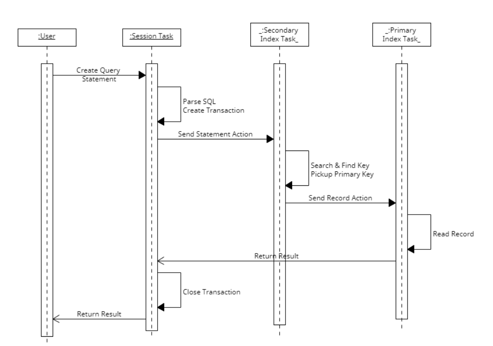
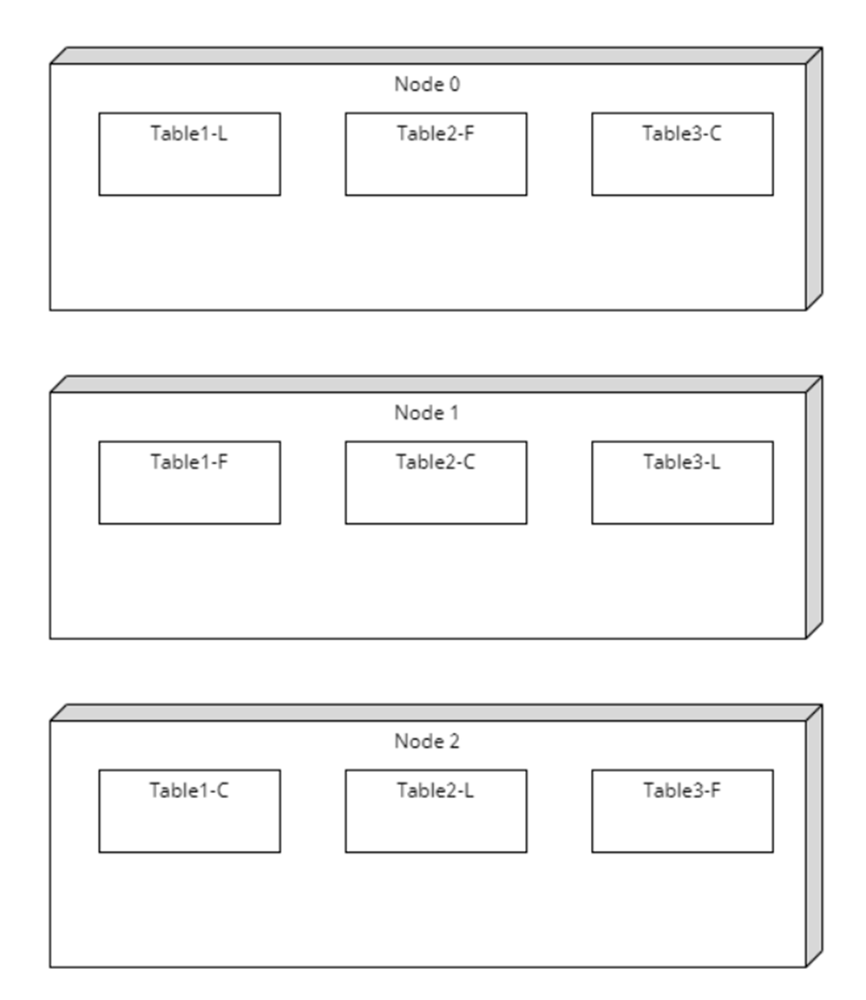

# 编译和测试

1. 环境 Ubuntu22.04以上版本
 
2. 安装依赖软件： 
sudo apt-get install libboost-all-dev -y 
sudo apt install build-essential -y 
sudo apt install clang clang-format -y 
sudo apt-get install openssh-server -y 
sudo apt-get install vim cmake bison flex net-tools git  -y 
sudo apt install libaio-dev -y 
sudo apt-get install ncurses-dev -y 
sudo apt install libreadline-dev -y 
 

3. 编译 
a) Release版本  
mkdir ./Release 
cp ErrorMsg.txt ./Release 
cd Release 
cmake -DCMAKE_BUILD_TYPE=Release -DCMAKE_CXX_COMPILER=g++ -DCMAKE_C_COMPILER=gcc  -DWITHOUT_BIN_LOG=on -DNO_WRITE_DISK=on .. 
cd ..  
b) Debug版本 
mkdir ./Debug 
cp ErrorMsg.txt ./Debug 
cd Debug 
cmake -DCMAKE_BUILD_TYPE=Debug -DCMAKE_CXX_COMPILER=g++ -DCMAKE_C_COMPILER=gcc -DCACHE_TRACE=off -DWITHOUT_BIN_LOG=off -DNO_WRITE_DISK=off ..   
c) 执行构建 
cmake --build .  
d) 参数定义 
WITHOUT_BIN_LOG  是否把更新写入BinLog文件用于崩溃恢复。 
NO_WRITE_DISK  是否把索引文件写盘。 
CACHE_TRACE 是否打印内存申请释放调试信息  
4. 测试 
a) 单元测试  
使用boost test开发单元测试用例，可以使用下面命令查看如何运行单元测试 
 ./UnitTest --help  
b) 压力测试   
该测试的目的是通过大规模的输入请求，测试出该软件最快能够达到的可处理的请求。 
<1> ./PressTest 11 [thread number] [row number] 
11 插入记录压力测试，通过多个线程同时互不相扰的压力插入记录，测试CPU的最大并发能力。 
thread number 同时运行线程数 
row number 每个线程插入的记录数 
<2> ./PressTest 12 [user threads] [session group num] [table task num] [sesion num] [row num] [query times] 
12 创建一个table，插入制定的记录数，然后执行指定次数的查询 
user threads 多少用户线程执行查询任务 
session group num 多少Session group去接收来自客户端的任务并处理，每个group占用一个线程去执行 
table task num 把table分成多少块，每块分别执行各自范围的查询任务 
sesion num 每个Session group有多少可以并发执行的session。 
row num 插入多少条记录用于测试 
query times 总的查询次数 
<3> ./PressTest 13 [session group num] [table num] [sesion num] [row num] [query times] 
13 创建若干个个table，每个user thread发起对应table的插入和查询请求，把请求发送到SessionGroup，然后分发到对应的table task执行 
session group num 多少Session group去接收来自客户端的任务并处理，每个group占用一个线程去执行 
table num 建立多少table，每个table对应一个user thread和后台table task，每个table task独占一个thread。 
sesion num 每个Session group有多少可以并发执行的session。 
row num 插入多少条记录用于测试 
query times 总的查询次数 
 
c) 命令行客户端 
这是一个服务端和客户端在一个进程中的运行SQL测试的命令行客户端代码，启动命令为： 
./sClient 
目前支持的SQL语法： 
show databases; 
create database "dbname"; 
drop database "dbname"; 
use "dbname"; 
show tables [from "dbname"]; 
create table "tblname"( 
    col1 datatype primayy key, 
    col2 datatype, 
    ... 
); 
drop table "tblname"; 
insert into "tblname" values(...); 
update "tblname" set col="val" ... where conditions; 
delete from "tblname" where condition; 
select * from  "tblname" where condition; 
select col1,col2,... from  "tblname" where condition; 
[注：]因为dev branch一直在修改，可以使用tag_test_<version>进行测试。
  

# RepidDB数据库简介  
&emsp;&emsp;RapidDB数据库是完全从头设计开发的数据库，实现了可以达到千万QPS级别的世界最快的数据库。RapidDB能够达到如此高的速度，是因为完全从头设计开发，没有依赖任何现有数据库产品，并在设计中充分利用目前计算机CPU超多内核和大内存的优势，通过多线程、高并发等技术来实现的。

<b>具体的技术实现归纳如下：</b>
1.	实现了高效无锁队列，线程之间通过无锁队列传递数据，共享资源，极大的提高了多线程的并发性；
2.	设计实现了一套内存池，通过两级缓存机制，每个线程有自己的小的缓存池，申请内存池，首先从本地缓存池申请，如果没有可使用内存，则从进程缓存池一次申请一批内存放入线程缓存池，释放时也会先放入线程缓存池，当多余一定数量时，才会把一批内存放回进程缓存池，这样可以极大地提高效率。为了方便内存的管理，内存申请时并不是需要多少申请多少，而是分成若干等级，每个等级分别管理，这样就不需要考虑内存的碎片化和合并的问题。
3.	设计实现了可自动伸缩的线程池，可以根据任务的繁忙程度自动增加或减少活跃线程，极大的增加了进程的伸缩性。
4.	对B+ tree进行了优化改进，对数据页的修改不再直接写入到数据页的内存块中，而是采用了缓存机制，使用一个数组对页内的记录进行管理维护，所有的增删改查操作全部直接在数组上，在符合一定条件时，例如写盘时间到了，或者数据页过大需要分页，才会考虑把数据的变动写入到数据页的内存块中。数据页也不会在数据量大于一页的限制时，马上分页，而是在需要写盘时或者数据量超过最大限额后才会分页，这样就减少了分页的次数，可以极大的提高效率。
5.	使用了Delay-Free技术，对于一些基本不需要修改的对象，例如table，SQL解析后的statement等对象，创建后不会对object本身进行修改，如需要修改则free旧的，创建新的object。旧的不会直接free掉，而是放到一个Obsolete队列中，有专门的ThreadTask定期访问这些 队列，确认没有地方使用后再free，这样就可以避免加锁的过程。
6.	通过把整个流程划分为Session Pool和Table Manager两个阶段，在代码中实现了更加灵活高效的设计。Client端发起的每一个链接称为一个Session，同一个Client可以建立若干个Session。Session Pool统一管理这些Session，按照Session ID把这些Session分成若干Group，一个或者多个Group运行在一个ThreadTask上。Session负责接收来自Client的request，，并进行初步处理后按照情况把request的后续处理发到对应的Table Manager进行处理。Table Manger为每个Index建立对应的ThreadTask，根据需要，可以为每个Index建立一到多个ThreadTask，每个task负责执行该table对应的Action。
下面是一个查询statement执行的时序图：

<b>后续研发方向：</b>
1.	继续完善功能，把目前还没有来得及完成的日志恢复、内存缓存管理、系统表、DDL等功能完善，争取尽快形成可用的产品；
2.	近期以内存数据库为主攻方向，又可分为Key-Value数据库和普通关系数据库两个方向，K-V数据库可以短期目标可以使用BRPC来实现Redis的接口，但是BPRC很难完全发挥Rapid的速度优势，长期目标独立开发实现K_V接口的RPC框架。关系数据库会继续目前的方向，实现基本的SQL功能，包括常用的建库、建表、增删改查等功能，查询会实现基本的查询功能，包括主索引、辅助索引，单点、范围查询，并且会将简单的表Join功能考虑进去。
3.	分布式系统是目前数据库系统的大方向，RapidDB也会向分布式系统发展。分布式系统的架构设计如下：
A）	系统有若干个节点组成，每个节点会有一个从0开始依次递增的ID。这些节点是平等的，Client端可以链接到任意一个节点进行操作；
B）	有一个System Database，负责记录用户库表的相关信息，包括有哪些库，那些表，这些表如何进行了分表，每个分表存放在那些节点等等信息；
C）	每一个分表有若干个拷贝组成，每个拷贝之间数据完全一致，其中一个拷贝是Leader，若干个Follower，若干个Candidate。所有的更新操作必须在Leader上发起，完成后把日志发送到Follower，在提交时确保Leader和所有Follower节点同时完成后才会提交事务。待事务提交完成后再把日志同步到Candidate。当Leader所在节点崩溃后，会按照设定规则从Follower中选择一个升级为Leader节点，如果Follower小于设定拷贝数，选择一个Candidate升级为Follower。如果Follower所在节点崩溃，也是按照设定选择一个Candidate升级为Follower。崩溃节点重启后，则该所在拷贝自动称为Candidate；
D）	基于改进的Raft协议保证数据的完整性，改进后的协议不再通过发起投票选举Leader，而是事先设定规则，这些节点之间按照一定的顺序依次排列，只有当前面的崩溃后，排在后面的才会自动成为Leader，这样可以减少选举的时间，提高效率；
E）	为了提高传输速度，会自动把多条数据压缩成一条数据进行发送。
